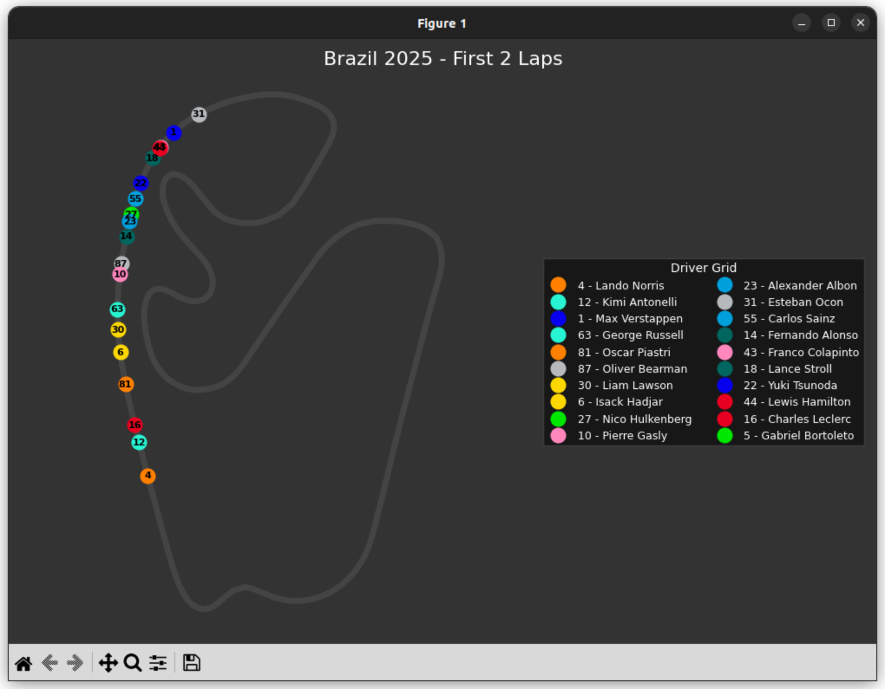

# 🏎️ F1 Race Telemetry Animator

A Python-based visualization tool that uses **FastF1** to animate driver positions on a track map using actual race telemetry data.



## 🛠️ Build & Setup Instructions

### 1. Create the Project Folder
Create a folder on your computer for this project and place the `main.py` script inside it.

### 2. Create the Cache Folder
The script requires a local directory to store downloaded telemetry and timing data. This prevents the script from having to re-download massive files every time you run it. 

**Create a folder named `cache` in the same directory as your script:**
```bash
mkdir cache
```

### 3. Install the requirements

**Install the requirements**
```bash
pip3 install -r requirements.txt
```

### 4. Run the script

```
python3 race.py
```
